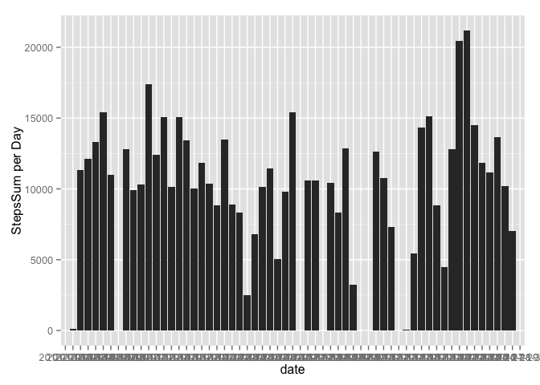
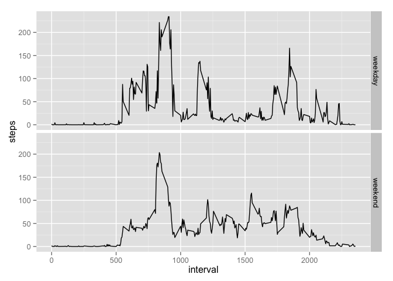

# Reproducible Research: Peer Assessment 1


## Loading and preprocessing the data

```r
unzip("activity.zip")
rawdata<- read.csv("activity.csv")

head(rawdata)
```

```
##   steps       date interval
## 1    NA 2012-10-01        0
## 2    NA 2012-10-01        5
## 3    NA 2012-10-01       10
## 4    NA 2012-10-01       15
## 5    NA 2012-10-01       20
## 6    NA 2012-10-01       25
```

## What is mean total number of steps taken per day?


```r
# 1. Make a histogram of the total number of steps taken each day
library(dplyr)
rawdata <- tbl_df(rawdata)
stepsSum <- summarize(
    group_by(rawdata, date), 
    stepsSumPerDay =sum(steps, na.rm=T)
    )# steps per day

library(ggplot2)
qplot(date, weight=stepsSumPerDay, data = stepsSum, geom="histogram", ylab="StepsSum per Day")
```

 

```r
#  2. Calculate and report the mean and median total number of steps taken per day
StepsMeanAndMedian <- summarize(group_by(rawdata, date), 
          stepsMeanPerDay = mean(steps, na.rm = T), 
          stepsMedianPerDay = median(steps, na.rm =T)) # 

head(StepsMeanAndMedian)
```

```
## Source: local data frame [6 x 3]
## 
##         date stepsMeanPerDay stepsMedianPerDay
## 1 2012-10-01             NaN                NA
## 2 2012-10-02         0.43750                 0
## 3 2012-10-03        39.41667                 0
## 4 2012-10-04        42.06944                 0
## 5 2012-10-05        46.15972                 0
## 6 2012-10-06        53.54167                 0
```

## What is the average daily activity pattern?


```r
# 1. Make a time series plot (i.e. type = "l") of the 5-minute interval (x-axis) and the average number of steps taken, averaged across all days (y-axis)
stepsInterval <- summarize(
    group_by(rawdata, interval), 
    stepsIntervalMean = mean(steps, na.rm=T)
    )

with(stepsInterval, 
     plot(interval, stepsIntervalMean, type = "l")
     )
```

 

```r
# 2. Which 5-minute interval, on average across all the days in the dataset, contains the maximum number of steps?
stepsInterval[
    which.max(
        stepsInterval$stepsIntervalMean
        )
    ,
    ]
```

```
## Source: local data frame [1 x 2]
## 
##   interval stepsIntervalMean
## 1      835          206.1698
```


## Imputing missing values


```r
#  1. Calculate and report the total number of missing values in the dataset (i.e. the total number of rows with NAs)
sum(is.na(rawdata))
```

```
## [1] 2304
```

```r
colSums(is.na(rawdata))
```

```
##    steps     date interval 
##     2304        0        0
```

```r
# 2. Devise a strategy for filling in all of the missing values in the dataset. The strategy does not need to be sophisticated. For example, you could use the mean/median for that day, or the mean for that 5-minute interval, etc.

stepsMean <- aggregate(steps~interval, data = rawdata, mean) # averaged steps grouped by interval

for (i in which(is.na(rawdata))) {
    rawdata[i, 1]  <-  stepsMean[
        which(
            stepsMean$interval %in% rawdata[i, 3]),
            2
        ]
}  # replace NA with averaged steps for that 5-minute interval

anyNA(rawdata)  # validate if there is any NA in data
```

```
## [1] FALSE
```


## Are there differences in activity patterns between weekdays and weekends?


```r
# 1. Create a new factor variable in the dataset with two levels – “weekday” and “weekend” indicating whether a given date is a weekday or weekend day.

library(lubridate)
rawdata$weekTime <- wday(rawdata$date) # weekTime: 1 is Sunday, 2 is Monday...

for (i in 1:nrow(rawdata))  {
    if (any(rawdata[i,4] == 2:6))  {rawdata[i,4] <- "weekday"}
    else {rawdata[i, 4] <- "weekend" }
}

# 2. Make a panel plot containing a time series plot (i.e. type = "l") of the 5-minute interval (x-axis) and the average number of steps taken, averaged across all weekday days or weekend days (y-axis). See the README file in the GitHub repository to see an example of what this plot should look like using simulated data.
stepsMean2 <- aggregate(steps~interval+weekTime, data = rawdata, mean)

library(ggplot2)
qplot(interval, steps, data = stepsMean2, facets = weekTime~. , geom="line")
```

 

